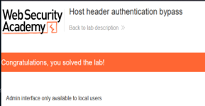

# Host Header Authentication Bypass

## Overview

Completed a practical PortSwigger Web Security Academy lab focused on exploiting an HTTP Host header vulnerability to bypass authentication controls.

## Objective

The objective of the lab was to investigate how the application handled the HTTP Host header and determine whether manipulating the header could be used to bypass access restrictions protecting administrative functionality.

## Tools

- Burp Suite
- PortSwigger Web Security Academy
- Web browser
- HTTP

## Skills Demonstrated

- HTTP request analysis
- Burp Suite
- HTTP header manipulation
- Authentication testing
- Access control testing
- Web application security
- Vulnerability analysis

## Methodology

Used Burp Suite to intercept and inspect HTTP requests sent to the application. I analysed how the application processed the Host header and modified the header to investigate whether the application relied on user-controlled request information when enforcing access restrictions.

## Outcome

Successfully completed the lab by demonstrating how improper handling of the HTTP Host header could allow authentication or access controls to be bypassed.

### Lab Completion Evidence

## Key Learning

This lab improved my understanding of HTTP Host header attacks and demonstrated why applications should not rely on untrusted HTTP headers when making security-sensitive access control decisions.
