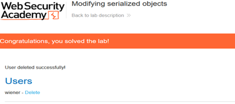

# Insecure Deserialization – Modifying Serialized Objects

## Overview

Completed a practical PortSwigger Web Security Academy lab focused on insecure deserialization and the security risks associated with trusting serialized user-controlled data.

## Objective

The objective of the lab was to investigate how the application handled serialized objects and determine whether modifying serialized data could alter application behaviour and bypass intended restrictions.

## Tools

- Burp Suite
- PortSwigger Web Security Academy
- Web browser
- HTTP

## Skills Demonstrated

- HTTP request analysis
- Burp Suite
- Insecure deserialization testing
- Serialized object manipulation
- Web application security
- Vulnerability analysis

## Methodology

Used Burp Suite to intercept and inspect HTTP requests containing serialized data. I analysed the structure of the serialized object and modified relevant values to investigate whether the application trusted user-controlled serialized information.

## Outcome

Successfully completed the lab by demonstrating how modifying serialized data could influence application behaviour when insufficient validation was performed.

### Lab Completion Evidence

## Key Learning

This lab improved my understanding of insecure deserialization...
