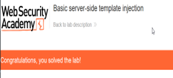

# Server-Side Template Injection (SSTI)

## Overview

Completed a practical PortSwigger Web Security Academy lab focused on server-side template injection (SSTI) and the security risks associated with unsafe processing of user-controlled input within server-side templates.

## Objective

The objective of the lab was to identify a server-side template injection vulnerability and investigate how user-controlled input could be interpreted by the application's template engine.

## Tools

- Burp Suite
- PortSwigger Web Security Academy
- Web browser
- HTTP

## Skills Demonstrated

- Web application security testing
- Burp Suite
- HTTP request analysis
- Server-side template injection
- Input manipulation
- Vulnerability analysis

## Methodology

Used Burp Suite to intercept and inspect HTTP requests and identify where user-controlled input was processed by the application. I modified the input to investigate whether it was being interpreted by the server-side template engine rather than being handled purely as data.

## Outcome

Successfully completed the lab by identifying and exploiting a basic server-side template injection vulnerability.

### Lab Completion Evidence

## Key Learning

This lab improved my understanding...
