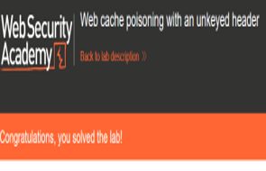

# Web Cache Poisoning with an Unkeyed Header

## Overview

Completed a practical PortSwigger Web Security Academy lab focused on web cache poisoning using an unkeyed HTTP header.

## Objective

The objective of the lab was to investigate how the application and its caching mechanism handled HTTP request headers and determine whether an unkeyed header could be manipulated to influence cached responses.

## Tools

- Burp Suite
- PortSwigger Web Security Academy
- Web browser
- HTTP

## Skills Demonstrated

- Web application security testing
- Burp Suite
- HTTP request and response analysis
- HTTP header manipulation
- Web cache poisoning
- Cache behaviour analysis
- Vulnerability analysis

## Methodology

Used Burp Suite to intercept and analyse HTTP requests and responses while investigating the application's caching behaviour. I examined how different request headers affected the generated response and identified an unkeyed header that could influence content without being included in the cache key.

## Outcome

Successfully completed the lab by demonstrating how an unkeyed HTTP header could be used to poison the web cache and influence responses subsequently served to users.

### Lab Completion Evidence

## Key Learning

This lab improved my understanding of web caching mechanisms, cache keys and the security risks created when user-controlled HTTP headers influence cached responses. It also demonstrated the importance of correctly configuring cache behaviour and preventing untrusted input from affecting cached content.
